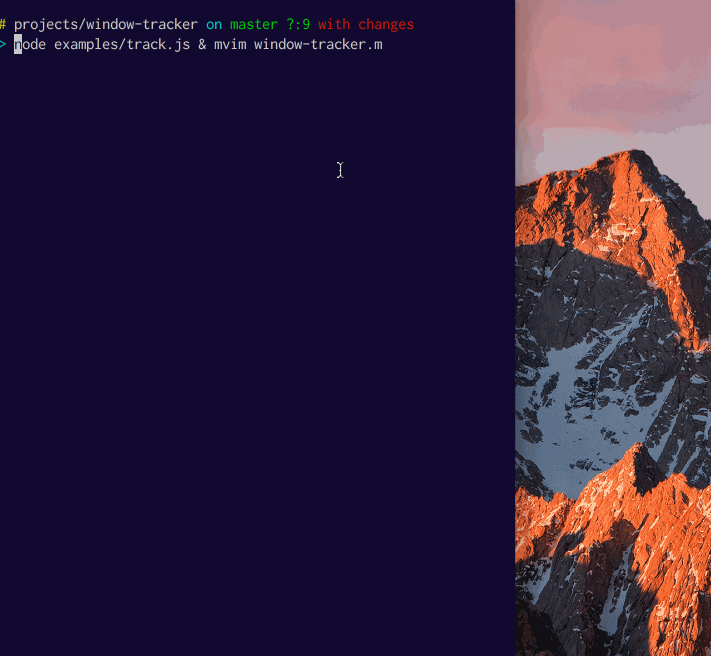

# window tracker

Currently only works on OSX _but could be extended to work on Linux and Windows_ **submit those PRs** ;)

## Installation

    npm install window-tracker



## Try it

```
cd node_modules/window-tracker && npm test
```

## API

### One time Query Interface

#### `windowTracker.query(cb)`

```js
// not using any filters here, so we'll see all windows output

const windowTracker = require('window-tracker')()
windowTracker.query(onresult)

function onresult(err, infos) {
  if (err) return console.error(err)
  console.log(infos)
}
```

```js
// abbreviated result
[ { app: 'TextEdit',
    appid: 93818,
    window: 'Untitled',
    windowid: 36182,
    bounds: { x: 364, y: 23, w: 842, h: 943 } ]
```

### Tracking Interface

#### `windowTracker.start()`

Make sure to subscribe to `error` and `info` when using the tracking interface.

```js
const { inspect } = require('util')
const getWindowTracker = require('window-tracker')

// appFilter and windowFilter can be a predicate or a RegExp
const appFilter = /MacVim/i
const windowFilter = /window-tracker/i

const windowTracker = getWindowTracker({ interval: 1000, appFilter, windowFilter })
  .on('error', console.error)
  .on('info', oninfo)
  .start()

let count = 0
function oninfo(info) {
  console.log(inspect(info, false, 5, true))
  if (++count > 20) windowTracker.stop()
}
```

## License

MIT
